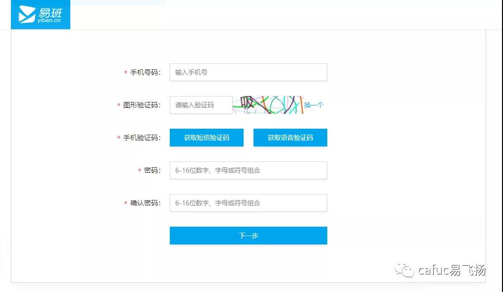
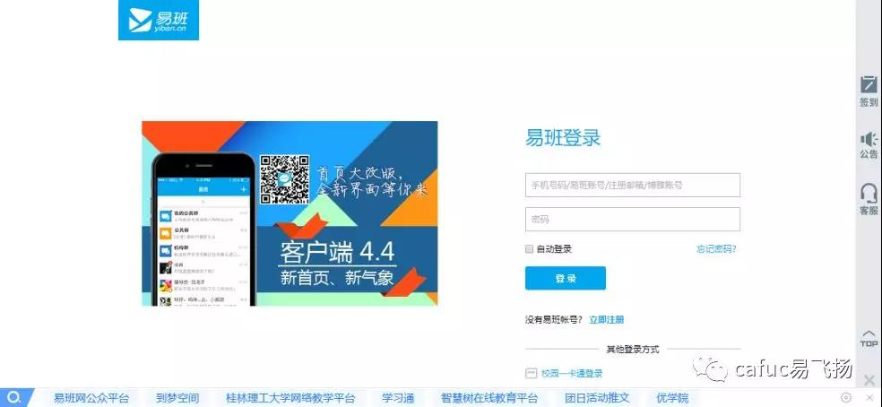
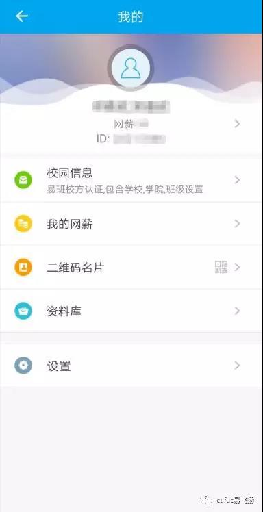
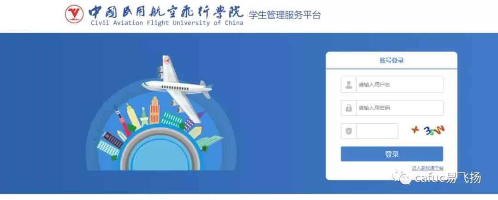
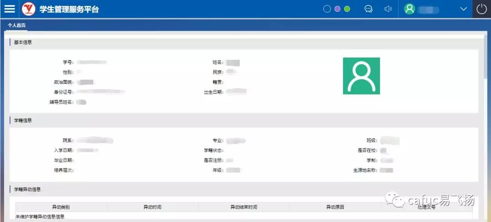
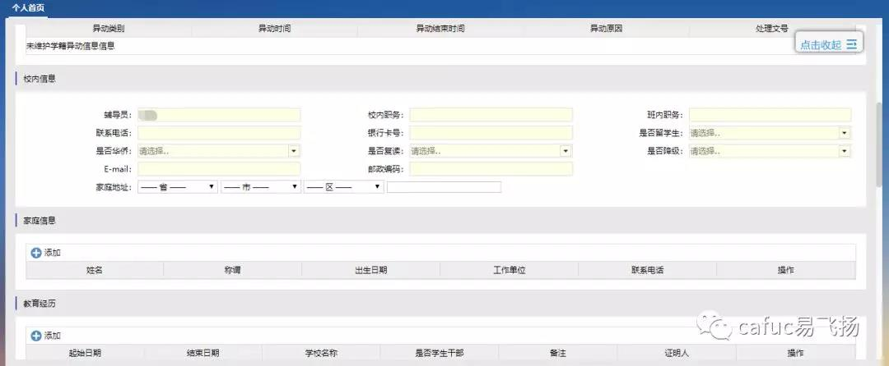
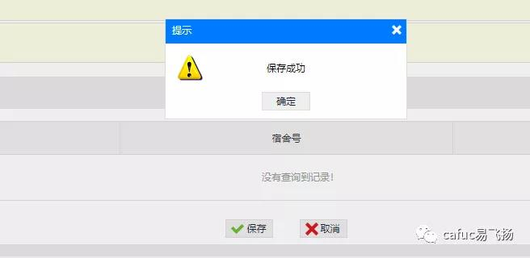
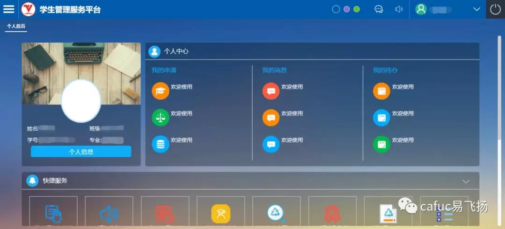

## 易班注册

易班作为全国优秀的大学生交流社区网络平台，成功地向当代大学生提供了教育教学，文化娱乐，生活等服务。为在校师生成功地定制了教育信息一体化的功能，并且支持web，手机客户端等多种访问形式。接下来，就让小编带大家了解一下怎么注册易班吧～

## 网页版
在网页上搜索：
<http://www.yiban.cn>

便会出现易班的网页

若是还未注册的小伙伴请点击右上角注册

完成注册的小伙伴可点击登录

这样就完成我们易班的注册啦

## 手机版

下载易班APP，打开界面进行注册

点击左上角个人信息部分

点击校园信息进行认证，根据你所在的专业班级进行认证（专业确定之后就无法修改了，所以一定要仔细哦）

## 学工系统

在网页上搜索：
<http://student.cafuc.edu.cn>
会出现学工系统的页面

用户名为学号或身份证号，  
密码为123456

登录后会出现如下界面，  
上面显示着你的个人信息

将页面下滑，完成剩下信息的填写（内容必须属实，你填写的信息将会影响到后期助学贷款，助学金及奖学金的领取，所有评优评奖学金资格都会以此信息为依据。）

完成信息后保存

保存成功后就可以查看个人中心了

如有以上情况出现，可以向各班长反馈，也可以后台私信我们，不要忘记关注我们哦，反馈后期会有相关问题的解答。

今天的介绍就到这里啦，你学会注册易班了吗？赶紧和身边的小伙伴一起使用起来吧，相信易班能够给大家带来更精彩的校园生活～

责编：黄海洋  
文字：记者部 邓嘉欣 何怡璇  
图片：记者部 邓嘉欣  
美编：记者部 何怡璇  
审核：赵磊 宋新月 蔺智荣 兰振伟 吴若昕  
主办：中飞院党委学生工作部易班发展中心

